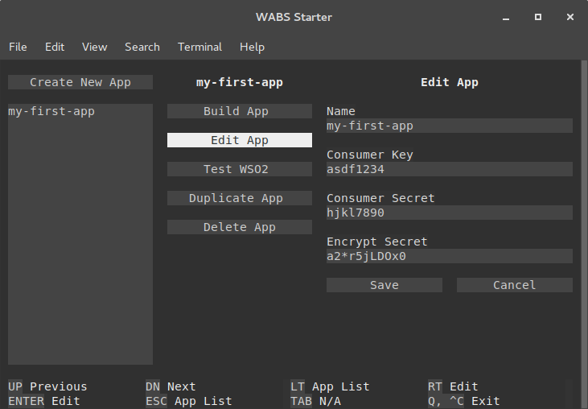

# WABS Starter

A command line tool for managing and running single page web applications ([SPA](#what-is-a-single-page-app)) that use [WABS](https://github.com/byu-oit/wabs-middleware) inside of a docker container.

## Installation

```sh
npm install -g @byu-oit/wabs-starter
```

## Create an App

1. Define your WSO2 application credentials.

    1. Set up a WSO2 application on [http://api.byu.edu/store](http://api.byu.edu/store).

    2. Navigate to `My Applications` and add an application.

        The callback URL should be `https://<your-domain>/wabs/oauth-code`. If you are developing on your local machine then your callback URL might look like this: `https://localhost:8080/wabs/oauth-code`.

    3. Navigate to `My Subscriptions`, select your application from the dropdown menu, and generate the credentials. You will need these credentials soon.

2. Start the [terminal application](#terminal-application): `wabs manage`

    1. Select `Create a New App`.

    2. Enter the name (numbers, letters, and dashes allowed).

    3. Enter consumer key and consumer secret.

    4. Enter encrypt secret. This is used to encrypt private data. You can choose any password, but it should be a good one.

    5. Save the changes.

    6. Select the option to `Build App`, fill out the form, and select `Build`.

    7. Exit the terminal application: `Ctrl-C`.

3. Navigate to the directory that the build was placed into.

4. Install dependencies: `wabs npm install`.

5. Start the application: `wabs start`

For additional commands see the WABS CLI help: `wabs help`


## What is a Single Page App?

**Important!!** You should understand this section before your proceed.

To promote consistency for BYU OIT Application Development the following definition for a single page app will be used:

1. A single [WSO2 application](http://api.byu.edu/store).

2. A single [Express server](http://expressjs.com).

3. A single `index.html` file.

4. A single domain name, for example: `my-app.byu.edu`.

#### A Single WSO2 Application

- WSO2 is our API store. If you want to make REST API calls then this is the tool you should be using.

- You must create a WSO2 app at [http://api.byu.edu/store](http://api.byu.edu/store).

- The WSO2 app must have a consumer key and consumer secret generated for it.

#### A Single Express Server

- We are using [Express server](http://expressjs.com) for our NodeJS servers.

- The server uses [wabs-middleware](https://github.com/byu-oit/wabs-middleware) to manage CAS authentication, WSO2 authorization, and interoperability with legacy frameworks.

- It serves static files from the `www` directory.

- It defines API routes in the `server/routes` directory.

#### A Single index.html File

- There is one `index.html` file and it resides at `www/index.html`.

- This is the root of your front-end application.

- It loads all CSS and JavaScript files (whether statically or dynamically) that are necessary for the entire application.

- It have multiple views. What is visible on the screen may change dramatically without navigating away from the `index.html` file.

- It may support multiple routes. A route causes the URL to look different but it is still on the same `index.html` file. Views are often tied to routes.

#### A Single Domain Name

- The domain will serve up exactly one `index.html` file.

- The domains `admissions.byu.edu` and `application.admissions.byu.edu` can point to two different single page apps.

## Terminal Application

The terminal application assists in the defining and creating of full stack single page web applications ([SPA](#what-is-a-single-page-app)) that uses [WABS](https://github.com/byu-oit/wabs-middleware). The terminal application can:

- Build a new [SPA](./starter/README.md) from a template.

- Manage the WSO2 credentials for [SPAs](./starter/README.md) defined on the machine.

- Test WSO2 credentials.

**Start the terminal application:** `wabs manage`



- The keyboard can be used to navigate the terminal application. See the keyboard help at the bottom.

- The terminal application may support mouse usage, depending on what terminal you are using.

- The left side has a list of all full-stack apps currently defined on the machine.

- Top left is a button to define a new full-stack app.

- The middle column is the full-stack app menu. Select an item to see details and list of controls in the right column.

## Alternate Usage

The above [usage](#usage) is the recommended usage, but if you'd like to do things by hand it's pretty straight forward too.

### Managing SPA Credentials

Credentials are stored in a file located in your home directory under `.wabs/config.json`. If you want to manually manage the credentials file then you need to modify this file. If you have not used the `wabs` command and saved an app then this file will not exist yet but it can be created either manually or through the `wabs` terminal application.

The credentials file is structured like this:

```json
{
  "my-first-app": {
    "consumerKey": "asdf1234",
    "consumerSecret": "hjkl7890",
    "encryptSecret": "a2*r5jLDOx0"
  }
}
```

### Building a Full Stack SPA

1. Download or clone the repository at [https://github.com/byu-oit/wabs-starter](https://github.com/byu-oit/wabs-starter)

2. Delete everything except the `starter` directory.

3. Do a find and replace for each of the following for the entire `starter` directory.

    - Replace `{{name}}` with the name of your app as defined in the `$HOME/.wabs/config.json` file.
    
4. Rename the `starter` directory to whatever you want.
